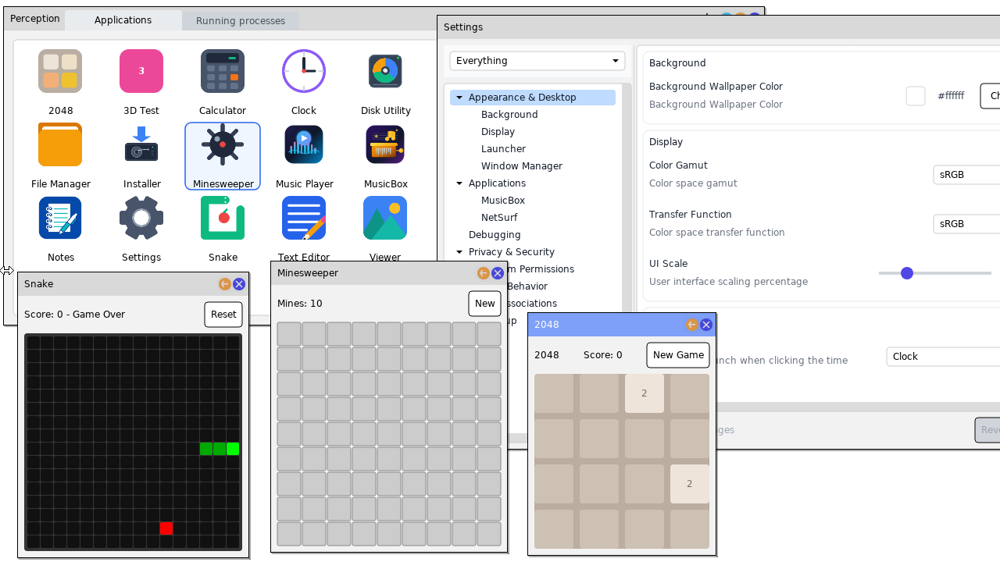
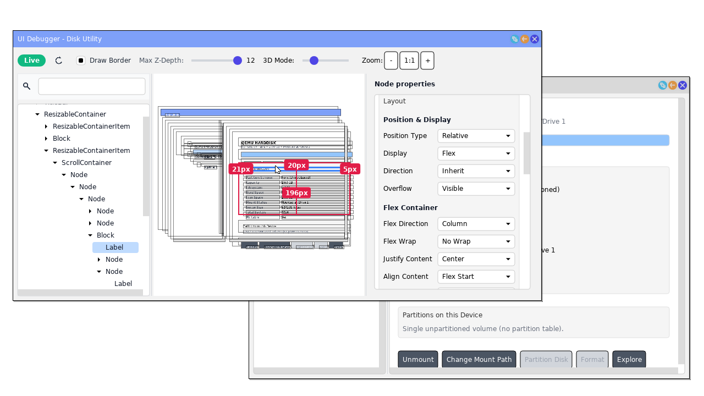
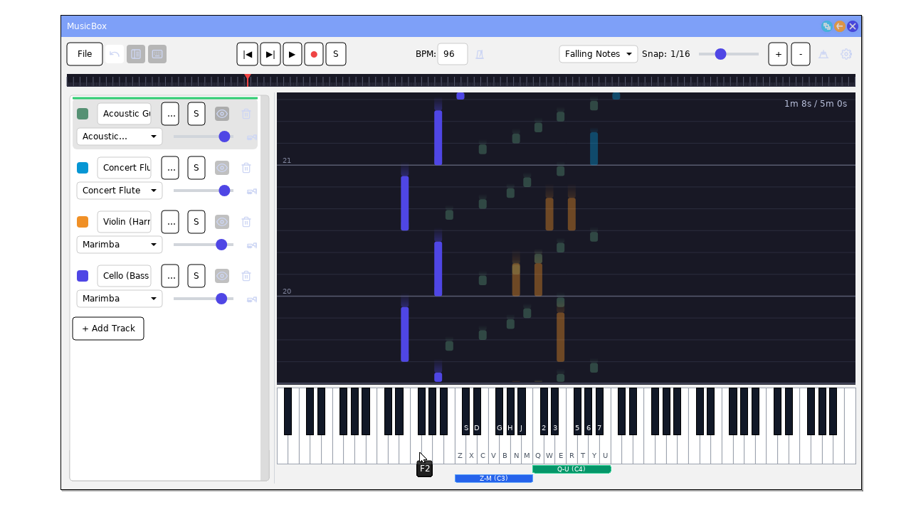

# Perception

Perception is a hobby operating system. It is a [x86-64](https://en.wikipedia.org/wiki/X86-64) operating system built around a [microkernel](https://en.wikipedia.org/wiki/Microkernel).

[The kernel](Services/Kernel/README.md) is written in C++. I use [a custom build system](Build/README.md). I provide a C++ runtime for libraries, services, drivers, and programs.

## Screenshots

### Assortment of Applications

### UI Debugger

### MusicBox

## Features

* **Microkernel Architecture & IPC**: Native x86-64 microkernel (minimal kernel with services and drivers in userland), preemptive multithreading, serializable C++ objects for RPCs, shared-memory IPC, and dynamic service registration and discovery.
* **C/C++ Runtime**: Full C and C++ standard libary support, dynamic shared libraries, and a fiber/event framework.
* **Hardware Drivers**: AHCI (SATA) and IDE storage controllers, Intel High Definition Audio (HDA), PS/2 keyboard and mouse, Virtio devices (GPU, Network, mouse, and tablet), CMOS real-time clock, and Multiboot framebuffer.
* **Storage & File Systems**: GPT and MBR partition table discovery, exFAT read/write filesystem, ISO 9660 CD-ROM, RAMDisk overlay filesystem.
* **Networking Stack**: TCP/IP stack (IPv4, TCP, UDP, DHCP client, DNS resolver), BearSSL TLS/HTTPS, and libcurl.
* **Desktop & Window Management**: Compositing window manager with damage-tracking quadtree, multi-window management, toast notifications, mouse and tablet pointer support, and clipboard service.
* **Perception UI Framework**: Declarative C++ GUI framework powered by Flexbox layout (Facebook Yoga), rich widget set (Tree View, Table, Markdown renderer, Color Picker, File Dialogs), and TrueType/OpenType font rendering (FreeType & HarfBuzz).
* **Graphics & Audio**: Mesa 3D OpenGL software rasterization (Gallium), SDL2 platform backends (SDL_mixer, SDL_image, SDL_sound), OpenAL Soft, and low-latency audio mixing.
* **Security & Permissions**: Fine-grained capability permissions model with interactive user prompts (e.g., launching programs, accessing storage, network, or audio), and hierarchical system registry with settings editor.
* **Loaded with Applications**: Many first party and third party.

## Building and running
See [building.md](building.md). Perception has only been tested in [QEMU](https://www.qemu.org/). It outputs debugging text via COM1.

## Directory Structure
- Applications - Applications/user programs.
- Drivers - Drivers.
- Libraries - The libraries for building user programs.
- Services - Services and the kernel.
- third_party - 3rd party code I didn't write. They have different licensing.

## Contributing
Being a personal hobby project, I'm not currently accepting other contributors. Feel free to build applications on top of my OS and let me know about them!

This is not an officially supported Google project.
